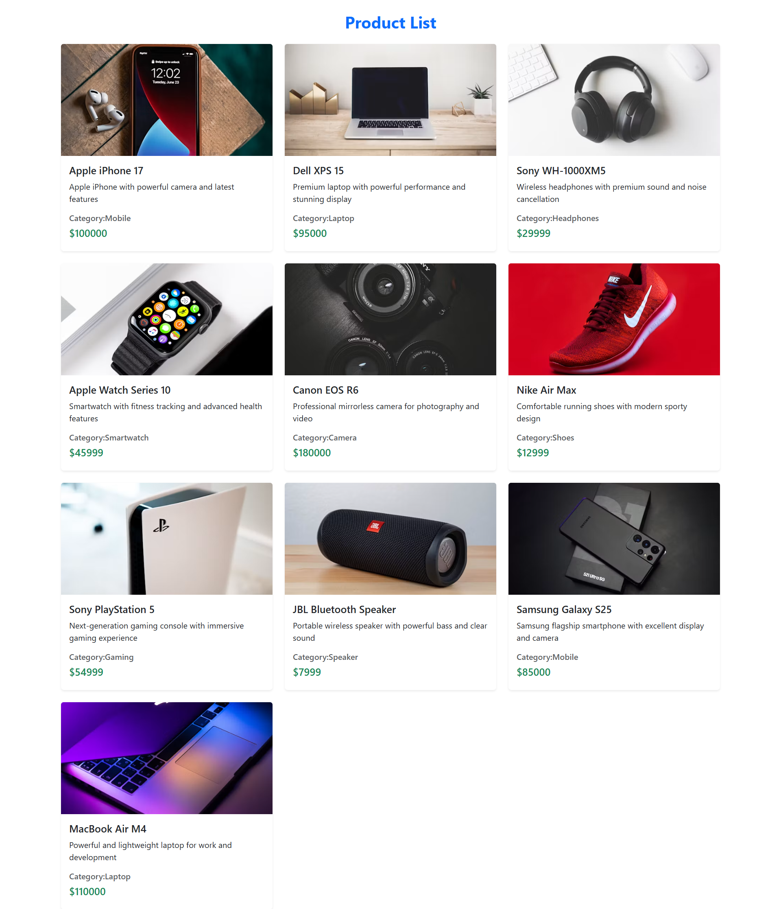

# 🛍️ Product Management Application

A full-stack Product Management Application built using **React.js, Node.js, Express.js, MongoDB, and Mongoose**.

The application allows users to manage products through a REST API and displays product information dynamically on the frontend.

---

## 🔗 Live Demo

👉 [View Live Project](YOUR_LIVE_LINK_HERE)

---

## 📸 Screenshot



---

## 🚀 Features

- Add new products
- Display all products
- Delete products
- Dynamic product listing
- Product title
- Product description
- Product price
- Product category
- Product image
- REST API using Express.js
- MongoDB database integration
- Mongoose for database management
- React.js frontend
- Responsive product cards
- Loading state
- CORS enabled
- Environment variables using `.env`

---

## 🛠️ Technologies Used

### Frontend

- React.js
- Vite
- Bootstrap
- JavaScript
- Fetch API

### Backend

- Node.js
- Express.js
- MongoDB
- Mongoose
- CORS
- dotenv

---

## 📁 Project Structure

```text
Backend_Assignment_1/
│
├── Backend/
│   ├── controller/
│   ├── models/
│   ├── routes/
│   ├── node_modules/
│   ├── .env
│   ├── .gitignore
│   ├── package.json
│   ├── package-lock.json
│   └── server.js
│
├── Frontend/
│   └── book_management/
│       ├── public/
│       ├── src/
│       ├── node_modules/
│       ├── .gitignore
│       ├── package.json
│       ├── package-lock.json
│       ├── index.html
│       └── vite.config.js
│
├── screenshots/
│   └── project.png
│
├── .gitignore
└── README.md
